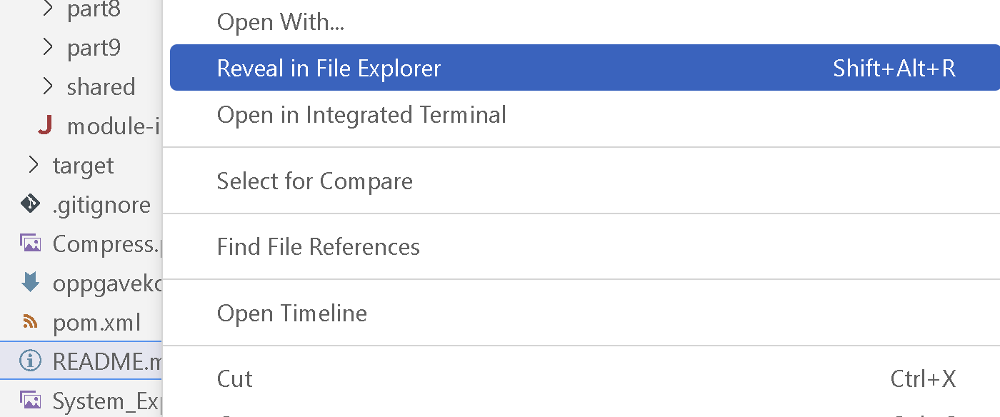

# TDT4100 Javaeksamen v2024 - eksamen 1

* Eksamen består av 5 delar.
* Kvar del utgjer 20 % av den totale eksamenskarakteren.
* Les NØYE gjennom dette dokumentet, README for kvar oppgåve og JavaDoc i koden som følgjer med.

## Kontekst
BMW AG er eit globalt konglomerat som produserer køyretøy i bil- og motorsykkelsegmenta verda over.
BMW har over 30 bilfabrikkar rundt om i verda. I BMWs siste rapport for rekneskapsåret 2023 rapporterer BMW at dei har produsert over 2 millionar einingar.

Dei ser likevel potensialet for å forbetra drifta ved å implementera eit system som vil hjelpa leiinga med å halda oversikt over produksjonen.

Sidan BMW bruker Java for andre system i selskapet, ønskjer dei at dette systemet også skal implementerast i Java.

BMW treng hjelp frå ein profesjonell Java-programmerar for å implementera dette systemet.

## Delar
Selskapet har eit spesifikt sett med krav til deg.
* [Del 1](src/main/java/com/bmw/manufacturing/part1/README.md) (20%) - BMW vil sikra at du har god forståing for Java-programmeringsspråket. Dei har laga 10 Java-programmeringsspørsmål for å testa kunnskapen din.
* [Del 2](src/main/java/com/bmw/manufacturing/part2/README.md) (20%) - I denne delen skal du implementera ein klasse og metodar for ein bilfabrikk og hovudkontor.
* [Del 3](src/main/java/com/bmw/manufacturing/part3/README.md) (20%) - I denne oppgåva skal du implementera eit globalt køyretøyidentifikasjonsnummer (VIN)-register og ei bilproduksjonslinje.
* [Del 4](src/main/java/com/bmw/manufacturing/part4/README.md) (20%) - I denne delen skal du implementera metodar for å lesa og skriva filer.
* [Del 5](src/main/java/com/bmw/manufacturing/part5/README.md) (20%) - I denne delen skal du implementera observer/observable-mønsteret, tilpassa unntak og delegering.


## Viktige merknader

1. Koden for alle delane ligg i [src/main/java/com/bmw/manufacturing](src/main/java/com/bmw/manufacturing/).

2. IKKJE MODIFISER KODEN i [src/main/java/no/ntnu/tdt4100/](src/main/java/no/ntnu/tdt4100/).

3. Det er _nokon_ testar tilgjengelege for del 1, 2 og 3. Dersom desse testane er grøne, indikerer det at implementeringa di er korrekt, og noko du kan byggja vidare på for å løysa resten av delen. For del 4 og 5 er det ein komplett testsuite tilgjengeleg.
Testane finst i mappa [test/java/com/bmw/manufacturing](./src/test/java/com/bmw/manufacturing/).
4. Hugs at du har tilgang til [Javadokumentasjonen](https://eksamensvedlegg.it.ntnu.no/felles/jdk-21.0.2_doc-all/api/index.html).

Du kan køyra testane på følgjande måtar:
* Du kan opna ein testklasse og køyra testen med den grøne avspelingsknappen på venstre side av testen. Pila (eller det raude symbolet for at testen 'feilar') ved linja for klassedefinisjonen køyrer alle* testane i klassen. Du kan også køyra ein spesifikk testmetode ved å klikka på denne.

* Du kan også leggja til eit ‘breakpoint' i testklassen eller andre klassar som blir brukt, og debugge testen. Dette gjer det mogleg å trinnvis gå gjennom koden. Du vel debug ved å høyreklikke på symbolet til venstre for linja ved metodestart.

* Når du køyrer testane *før* du har implementert noko for ein del, vil du oppdaga at nokre av testane er grøne. Dette er rett åtferd. Sørg for at alle testane også er grøne etter at du har implementert kode.

Kvar oppgåve i eksamen er merkt med ein // TODO-kommentar. Du kan få ei oversikt over alle TODOs i Problems-fanen som ligg i nedre del av redigeringsvindauget i VS Code. Du finn han også i toppmenyen under View -> Problems.

Når JavaDoc eksplisitt spesifiserer eit  klasse- eller metodenamn (med JavaDoc her meiner me kommentarane som ligg før ein klasse eller metodes definisjon), må du bruka namnet nøyaktig som definert i JavaDoc,
dvs. når JavaDoc spesifiserer at klassen skal heita `CarFactory`, skal han ikkje heita `carFactory`, `carfactory` eller `CARFACTORY`.

I oppgåver der unntak skal utløysast treng du ikkje bruker tid på spesifisera ei melding. 

Viss du ikkje skulle klara å implementera ein metode i éin klasse kan du sjølvsagt bruka denne vidare som om han verka. Merk at metoden bør framleis kompilera, alle metodar kompilerer ved hjelp av _dummy_ return verdiar, som er verdiar av rett type, men ikkje korrekte. Metodar med feil vil ikkje vera synlege som moglege metodar å bruka i VS Code, og dermed gi raud strek.

Ein metode som ikkje kompilerer kan gi null poeng.

Feil i koden din, som NullPointerException er ikkje kompileringsproblem (men vil sjølvsagt ikkje gi full poengsum). De bør testa dykkar eigen kode slik at de veit at denne køyrer. Me tilrår at du bruker testane som er lagde ved. Du kan også kopiera ein test over til eit nytt testnamn og leggja til eventuelle ytterlegare metodekall du ønskjer å testa. 

# Kompilering
*Det skal ikkje vera nokon kompileringsfeil når du sender inn arbeidet ditt. Metodar som ikkje kompilerer, kan telja 0 poeng.*

Sørg for at koden kompilerer før du sender den inn. I ein terminal, på stien som inneheld `pom.xml`, kan du utføra følgjande kommando:

```bash
mvn clean compile
```

## Etter at zipfilen er pakka ut
Etter at du har lasta ned zip-fil, så unzip denne. Dette gir ei mappe som heiter **ord-2024**.

### For Visual Studio Code
Gå så inn i VSCode, og gå til File -> Open Folder. Eit filnavigeringsvindauge blir opna. Finn fram til mappa du unzippet (**ord-2024*), og vel denne.
VSCode vil då, pga. POM-fila som ligg i mappa, automatisk finna ut at dette er eit Maven Java-prosjekt. (Under føresetnad at Java-utvidinga er installert i VSCode.)


## Spesialteikn i Windows: teikn som alfakrøll, [], {}, |
I Windows legg ein inn desse på ein litt annan måte enn i OS X! Alle kan sjåast på tastaturet, viss teikna står nedst til høgre på tasten får ein det gjennom å halda inn alt-gr (tasten til høgre for mellomrom) samtidig med tasten med teiknet.
- | er øvst til venstre
- @ er alt-gr og 2
- [,] er alt-gr  og 8,9
- {,} er alt-gr og 7, 0

## Snarvegar i VS Code
- Sjå tastatursnarvegar: ctrl-shift-p - skriv inn keyboard  - Open Keybord Shortcuts
- Gå til førre stad du var i koden: alt-venstrepil - alt-høyrepil for framover. Som nettlesar!
- Klikk på eit metodenamn, trykk på F12 og då hoppar du inn i koden for denne metoden.

## Levering

**__Sørg for å lagra alle filene i VS *Code før du *zipper foldaren.__**
Du kan gjera det via menyvalet File -> Save All

Når eksamen skal leverast kan du gjera dette på denne måten:
Kortform: Den same mappa som du pakka ut, den skal du pakka inn i .zip-format.

-   Viss du ikkje har ein utforskarmeny til venstre: høgreklikk på ikonet for 'Explorer' øvst til venstre (to papirark oppå kvarandre)
-   Klikk i eit tomt område i VSCodes 'Explorer' (der alle filene til prosjektet ligg) eller høgreklikk på README.md-filen.
-   Vel 'Reveal in File Explorer' (Windows)
-   Du skal no få opp eit utforskarvindauge (i Windows) som skal innehalda den foldaren du pakka ut. Denne foldaren inneheld prosjektfoldaren me skal komprimera.
-   Høgreklikk på denne foldaren -> 7-zip -> Add to "ord-2023.zip" 
-   Denne zipfilen er fila de skal lasta opp til Inspera til slutt.
-   De finn eit par bilete av prosessen til slutt i denne fila (med feil årstal)


**Visual Studio Code Explorer*



**Compress*

