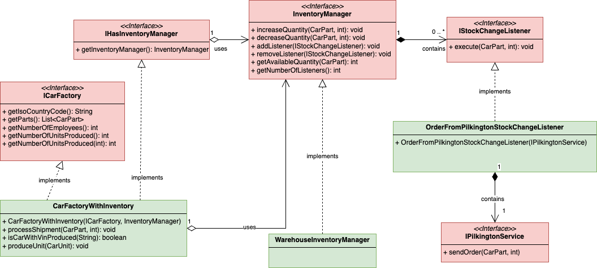

# Del 5 (20%)

Denne delen handlar om delegering, tilpassa unntak og observatør/observert-teknikken.

Du skal implementere følgjande klassar:

* [CarFactoryWithInventory.java](CarFactoryWithInventory.java)
* [WarehouseInventoryManager.java](WarehouseInventoryManager.java)
* [OrderFromPilkingtonStockChangeListener.java](OrderFromPilkingtonStockChangeListener.java)

## Kontekst
Lageret til ein bilfabrikk er av avgrensa storleik. Fabrikken kan ikkje lagra eit ubegrensa antal varer på lager.
Fabrikken er avhengig av eit optimalisert varelager, noko som betyr å ha eigna system for å handtere lageret av dei ulike bildelane medan bilane blir produserte. Nokre bildelar tar lengre tid å skaffe enn andre, og bestillingsprosessen mot leverandørane av bildelar blir handtert ulikt. Nokre leverandørar har moderne system og kan handtere automatiserte bestillingar, medan andre handterer bestillingar manuelt via e-post.

For å sikre at BMW har fleksibiliteten til å handtere denne kompleksiteten, må du implementere oppførselen til ein del ulike klassar.

Under er UML-klassediagrammet for denne delen. Klassane i RØDT er gitt.
Klassane i GRØNT er dei du må implementere.

## Oppgåver

1. Implementer klassen [WarehouseInventoryManager](WarehouseInventoryManager.java)
2. Implementer klassen [OrderFromPilkingtonStockChangeListener](OrderFromPilkingtonStockChangeListener.java)
3. Implementer klassen [CarFactoryWithInventory](CarFactoryWithInventory.java).

# Testar

Eit komplett sett med testar er levert for å støtte deg i denne delen.
* [Testar for WarehouseInventoryManager](../../../../../../test/java/com/bmw/manufacturing/part5/WarehouseInventoryManagerTests.java)
* [Testar for OrderFromPilkingtonStockChangeListener](../../../../../../test/java/com/bmw/manufacturing/part5/OrderFromPilkingtonStockChangeListenerTests.java)
* [Testar for CarFactoryWithInventory](../../../../../../test/java/com/bmw/manufacturing/part5/CarFactoryWithInventoryTests.java)

