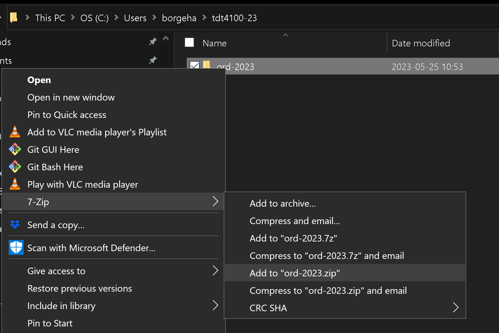

# TDT4100 Java Exam v2024 - Exam 1

* The exam consists of 5 parts
* Each part counts 20% of total exam score
* Read CAREFULLY this document, the README for each task, and JavaDoc in the supplied code

## Context
BMW AG is a global conglomerate that manufactures vehicles in the automotive and motorcycle segments worldwide.
BMW has over 30 car factories around the world.
In BMWs latest report fiscal year 2023, BMW reports to have produced over 2 million units.

However, they see the potential of improving their operations by implementing a system which will help management to keep track on production.

Since BMW use Java for other systems in their company, they want this system to be implemented in Java as well.

BMW needs help from a professional Java programmer to implement this system. 

## Parts
The company has a specific set of requirements laid out for you. 
* [Part 1](src/main/java/com/bmw/manufacturing/part1/README_en.md) (20%) - BMW wants to make sure you have a firm grasp on the Java programming language. They have created 20 Java programming questions to test your knowledge.
* [Part 2](src/main/java/com/bmw/manufacturing/part2/README_en.md) (20%) - in this part, you will implement a class and methods for a car factory and main office.
* [Part 3](src/main/java/com/bmw/manufacturing/part3/README_en.md) (20%) - in this task, you will implement a global vehicle identification number (VIN) register and a car production line
* [Part 4](src/main/java/no/ntnu/tdt4100/oppgave1/README_en.md) (20%) - in this part you will implement methods to read and write files
* [Part 5](src/main/java/no/ntnu/tdt4100/oppgave1/README_en.md) (20%) - in this part you will implement the observer / observable patterns, custom exceptions and delegation

## Important notes

1. The code for all parts is located in [src/main/java/com/bmw/manufacturing](src/main/java/com/bmw/manufacturing/)

2. DO NOT MODIFY CODE in [src/main/java/no/ntnu/tdt4100/](src/main/java/no/ntnu/tdt4100/)

3. There are _some_ unit tests provided for part 1, 2 and 3. Passing tests indicate that your implementation is correct. For parts 4 and 5 a complete test suite is provided.
The tests are located in the [test/java/com/bmw/manufacturing](./src/test/java/com/bmw/manufacturing/) folder.

4. Remember that you have access to the [Java documentation](https://eksamensvedlegg.it.ntnu.no/Felles/jdk-21.0.2_doc-all/api/index.html).

You can run the tests in the following ways:
* You can open a test class and run the test with the green play button on the left side of the test. The arrow (or the red symbol indicating that the test 'fails') at the line of the class definition runs *all* the tests in the class. You can also run a specific test method by clicking on it.

* You can also add a 'breakpoint' in the test class or other classes that are used, and debug the test. This makes it possible to step through the code. You select debug by right-clicking on the symbol to the left of the line at the method start.

* When you run the tests *before* you have implemented something for a while, you will discover that some of the tests are green. This is the right behavior. Make sure all the tests are also green after you have implemented your code.

Each task in the exam is marked with a // TODO comment. You can get an overview of all TODOs in the Problems tab located in the lower part of the editing window in VS Code. You can also find it in the top menu under View -> Problems.

When JavaDoc explicitly specifies a class or method name (by JavaDoc here we mean the comments that are positioned above class or method definitions), you must use the name exactly as defined in the JavaDoc,
i.e., when JavaDoc specifies that the class should be called `CarFactory`, it should not be called `carFactory`, `carfactory` or `CARFACTORY`.

In tasks where exceptions are to be triggered, you do not need to spend time specifying a message.

If you should fail to implement a method in one class, you can of course use this further as if it worked. Note that the method should still compile, all methods compile using _dummy_ return values, which are values of the correct type, but not correct. Methods with errors will not be visible as possible methods to use in VS Code, and thus give a red line.

A method that does not compile may give zero points.

Errors in your code, like NullPointerException are not compilation problems (but will of course not give full points). You should test your own code so that you know that it runs. We recommend that you use the tests that are included. You can also copy a test over to a new test name and add any additional method calls you want to test.

## Compilation
**There should be NO compilation errors upon submitting your work. Methods that do not compile could count as 0 points.** 

Please make sure that the code compiles before submitting it. 
In a terminal, on the path that contains pom.xml, execute the following command

```mvn clean compile```

Uncomment or fix the parts that Maven reports as errors.

## After the zip file is unpacked
After you have downloaded the zip file, unzip it. This gives a folder named **ord-2024**.

### For Visual Studio Code
Then go into VSCode, and go to File -> Open Folder. A file navigation window opens. Find the folder you unzipped (**ord-2024**), and select it.
VSCode will then, due to the POM file located in the folder, automatically find out that this is a Maven Java project. (Assuming that the Java extension is installed in VSCode.)


## Special characters in Windows: characters like at sign, [], {}, |
In Windows, these are entered in a slightly different way than in OS X! All can be seen on the keyboard, if the character is at the bottom right of the key you get it by holding in alt-gr (the key to the right of space) at the same time as the key with the character.
- | is at the top left
- @ is alt-gr and 2
- [,] is alt-gr and 8,9
- {,} is alt-gr and 7, 0

## Shortcuts in VS Code
- See keyboard shortcuts: ctrl-shift-p - type in keyboard - Open Keyboard Shortcuts
- Go to the previous place you were in the code: alt-left arrow - alt-right arrow for forward. Like a browser!
- Click on a method name, press F12 and then you jump into the code for this method.

## Delivery

**__Make sure to save all your files in VS Code before zipping the folder.__**
You can do that via the menu option File -> Save All 

When the exam is to be delivered, you can do this in the following way:
In short: The same folder that you unpacked, you should pack in .zip format.

-   If you do not have an explorer menu to the left: right-click on the icon for 'Explorer' at the top left (two pieces of paper on top of each other)
-   Click in an empty area in VSCode's 'Explorer' (where all the files for the project are) or right-click on the README.md file.
-   Choose 'Reveal in File Explorer' (Windows)
-   You should now get up an explorer window (in Windows) that should contain the folder you unpacked. This folder contains the project folder we are going to compress.
-   Right-click on this folder -> 7-zip -> Add to "ord-2023.zip" 
-   This zip file is the file you should upload to Inspera in the end.
-   You will find a couple of pictures of the process at the end of this file (with the wrong year)


**Visual Studio Code Explorer**


**Compress**

