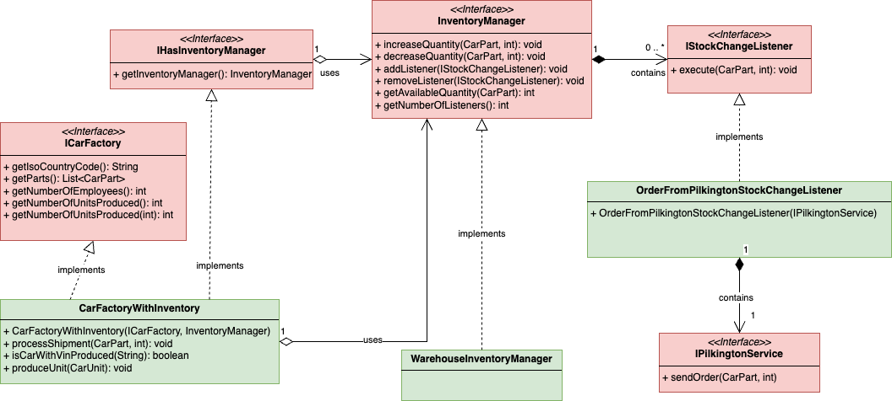

# Del 5 (20%)

Denne delen handler om delegering, tilpassede unntak og observatør/observert-teknikken.

Du skal implementere følgende klasser:

* [CarFactoryWithInventory.java](CarFactoryWithInventory.java)
* [WarehouseInventoryManager.java](WarehouseInventoryManager.java)
* [OrderFromPilkingtonStockChangeListener.java](OrderFromPilkingtonStockChangeListener.java)

## Kontekst
Lageret til en bilfabrikk er av begrenset størrelse. Fabrikken kan ikke lagre et ubegrenset antall varer på lager.
Fabrikken er avhengig av et optimalisert varelager, noe som betyr å ha egnet system for å håndtere lageret av de ulike bildelene mens bilene blir produsert. Noen bildeler tar lengre tid å skaffe enn andre, og bestillingsprosessen mot leverandørene av bildeler blir håndtert forskjellig. Noen leverandører har moderne system og kan håndtere automatiserte bestillinger, mens andre håndterer bestillinger manuelt via e-post.

For å sikre at BMW har fleksibiliteten til å håndtere denne kompleksiteten, må du implementere 
oppførselen til en del ulike klasser.

Under er UML-klassediagrammet for denne delen. Klassene i RØDT er gitt.
Klassene i GRØNT er de du må implementere.

## Oppgaver

1. Implementer klassen [WarehouseInventoryManager](WarehouseInventoryManager.java)
2. Implementer klassen [OrderFromPilkingtonStockChangeListener](OrderFromPilkingtonStockChangeListener.java)
3. Implementer klassen [CarFactoryWithInventory](CarFactoryWithInventory.java).

# Enhetstester

Et komplett sett med enhetstester er levert for å støtte deg i denne delen.
* [Tester for WarehouseInventoryManager](../../../../../../test/java/com/bmw/manufacturing/part5/WarehouseInventoryManagerTests.java)
* [Tester for OrderFromPilkingtonStockChangeListener](../../../../../../test/java/com/bmw/manufacturing/part5/OrderFromPilkingtonStockChangeListenerTests.java)
* [Tester for CarFactoryWithInventory](../../../../../../test/java/com/bmw/manufacturing/part5/CarFactoryWithInventoryTests.java)
