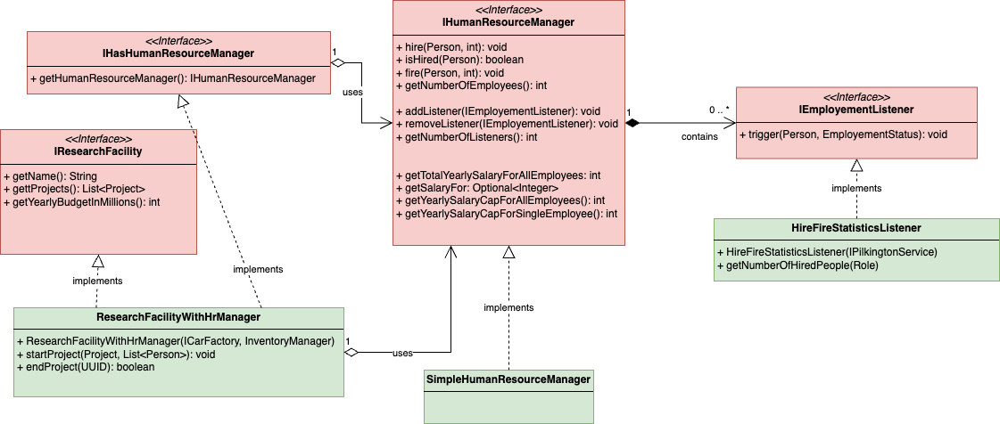

# Part 5 (20%)

This part is about delegation, custom exceptions and observer/observable pattern.

You will be implementing the following classes:

* [HireFireStatisticsListener.java](HireFireStatisticsListener.java)
* [SimpleHumanResourceManager.java](SimpleHumanResourceManager.java)
* [ResearchFacilityWithHrManager.java](ResearchFacilityWithHrManager.java)

## Context
Every research facility needs a good way of handling its employees.

To ensure Mercedes has the flexibility to manage this complexity, you need to implement 
some behaviour in different classes.

Below is the UML class diagram for this part. The classes in RED are provided.
The classes in GREEN are the ones you need to implement.

## Tasks

1. Implement the [SimpleHumanResourceManager](SimpleHumanResourceManager.java) class
1. Implement the [HireFireStatisticsListener](HireFireStatisticsListener.java) class
1. Implement the [ResearchFacilityWithHrManager](ResearchFacilityWithHrManager.java) class.

# Unit tests

A complete set of unit tests is supplied to support you for this part.
* [Tests for SimpleHumanResourceManager](../../../../../test/java/com/mercedesbenz/part5/SimpleHumanResourceManagerTests.java)
* [Tests for HireFireStatisticsListener](../../../../../test/java/com/mercedesbenz/part5/HireFireStatisticsListenerTests.java)
* [Tests for ResearchFacilityWithHrManager](../../../../../test/java/com/mercedesbenz/part5/ResearchFacilityWithHrManagerTests.java)