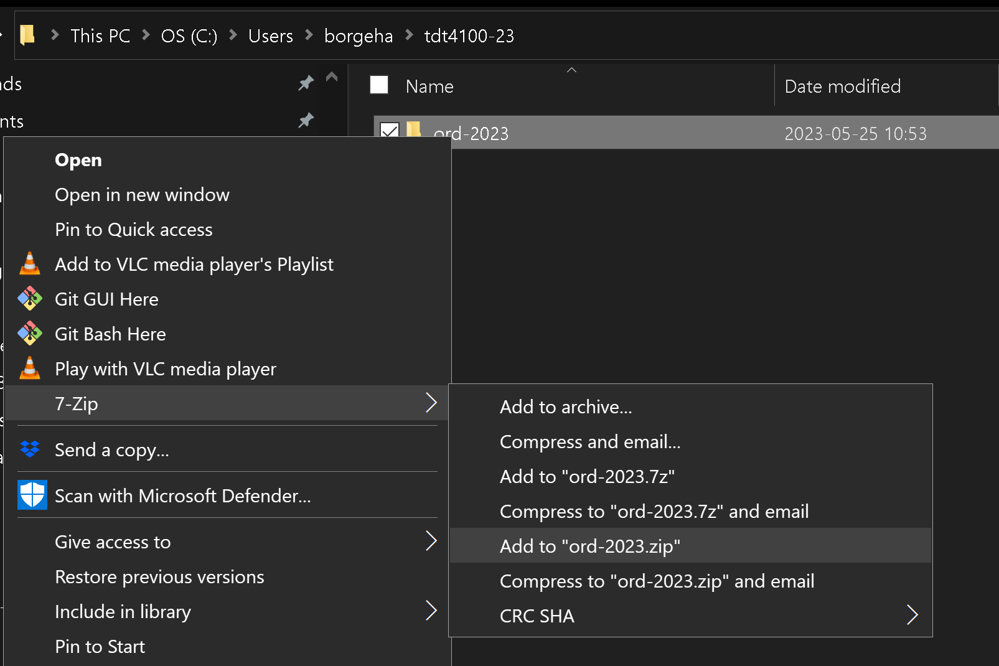

# TDT4100 Javaeksamen v2024 - eksamen 2

* Eksamen består av 5 deler.
* Hver del utgjør 20 % av den totale eksamenskarakteren.
* Les NØYE gjennom dette dokumentet, README for hver oppgave og JavaDoc i koden som følger med.


## Kontekst
Mecedes-Benz Group AG er et globalt konglomerat som produserer kjøretøy.
De produserer over 2 millionar enheter årlig.

Likevel ser de potensialet i å forbedre driften ved å implementere et system som vil hjelpe ledelsen med å optimalisera hvordan forskingsfasilitetane deres fungerer.

Siden Mercedes-Benz bruker Java til andre system i bedriften, ønsker de at dette systemet også skal implementeres i Java.

Mercedes-Benz trenger hjelp fra en profesjonell Java-programmerer for å implementere dette systemet.

## Deler
Selskapet har en spesifikk liste med krav lagt ut for deg.
* [Del 1](src/main/java/com/mercedesbenz/part1/README.md) (20%) - Mercedes ønsker å forsikre seg om at du har et solid grep om programmeringsspråket Java. De har laget 10 programmeringsspørsmål for å teste kunnskapen din.
* [Del 2](src/main/java/com/mercedesbenz/part2/README.md) (20%) - i denne delen vil du implementere en klasse og metoder for et forskningsanlegg og gruppehovedkvarter.
* [Del 3](src/main/java/com/mercedesbenz/part3/README.md) (20%) - i denne oppgaven vil du implementere et globalt forskningsregister og monteringslinje.
* [Del 4](src/main/java/com/mercedesbenz/part4/README.md) (20%) - i denne delen vil du implementere metoder for å lese og skrive filer.
* [Del 5](src/main/java/com/mercedesbenz/part5/README.md) (20%) - i denne delen vil du implementere teknikken observatør-observert, egendefinerte unntak og delegering.


## Viktige merknader

1. Koden for alle deler er plassert i [src/main/java/com/mercedesbenz/](src/main/java/com/mercedesbenz/)

2. IKKE MODIFISER KODEN i [src/main/java/no/ntnu/tdt4100/](src/main/java/no/ntnu/tdt4100/)

3. Det er _noen_ tester gitt for del 2 og 3. Beståtte tester indikerer at implementasjonen din er korrekt. For deler 4 og 5 er en komplett testsuite gitt.
Testene er plassert i mappen [src/test/java/com/mercedesbenz/](src/test/java/com/mercedesbenz/).

Du kan kjøre testene på følgende måter:
* Du kan åpne en testklasse og kjøre testen med den grønne avspillingsknappen på venstre side av testen. Pilen (eller det røde symbolet for at testen 'feiler') ved linjen for klassedefinisjonen kjører *alle* testene i klassen. Du kan også kjøre en spesifikk testmetode ved å klikke på denne.

* Du kan også legge til et ‘breakpoint’ i testklassen eller andre klasser som blir brukt, og debugge testen. Dette gjør det mulig å trinnvis gå gjennom koden. Du velger debug ved å høyreklikke på symbolet til venstre for linjen ved metodestart.

Når du kjører testene *før* du har implementert noe for en del, vil du oppdage at noen av testene er grønne. Dette er riktig oppførsel. Sørg for at alle testene også er grønne etter at du har implementert kode.

4. Hver oppgave i eksamen er merket med en // TODO-kommentar. Du kan få en oversikt over alle TODOs i Problems-fanen som ligger i nedre del av redigeringsvinduet i VS Code. Du finner den også i toppmenyen under View -> Problems.

5. Husk at du har tilgang til [Javadokumentasjonen](https://eksamensvedlegg.it.ntnu.no/Felles/jdk-21.0.2_doc-all/api/index.html).

Når JavaDoc eksplisitt spesifiserer et  klasse- eller metodenavn (med JavaDoc her mener vi kommentarene som ligger før en klasse eller metodes definisjon), må du bruke navnet nøyaktig som definert i JavaDoc,
dvs. når JavaDoc spesifiserer at klassen skal hete `ResearchFacility`, skal den ikke hete `researchFacility`, `researchfacility` eller `RESEARCHFACILITY`.

I oppgaver hvor unntak skal utløses trenger du ikke bruker tid på spesifisere en melding. 

Hvis du ikke skulle klare å implementere en metode i én klasse kan du selvfølgelig bruke denne videre som om den virket. Merk at metoden bør fortsatt kompilere, alle metoder kompilerer ved hjelp av _dummy_ return verdier, som er verdier av riktig type, men ikke korrekte. Metoder med feil vil ikke være synlige som mulige metoder å bruke i VS Code, og dermed gi rød strek.

Feil i koden din, som NullPointerException er ikke kompileringsproblemer (men vil selvfølgelig ikke gi full poengsum). Dere bør teste deres egen kode slik at dere vet at denne kjører. Vi anbefaler at du bruker testene som er lagt ved. Du kan også kopiere en test over til et nytt testnavn og legge til eventuelle ytterligere metodekall du ønsker å teste. 

## Kompilering
**Det skal ikke være noen kompileringsfeil når du sender inn arbeidet ditt. Metoder som ikke kompilerer, vil kunne gi 0 poeng.**

Sørg for at koden kompilerer før du sender den inn. I en terminal, på stien som inneholder `pom.xml`, kan du utføre følgende kommando:

```bash
mvn clean compile
```

## Etter at zipfilen er pakket ut
Etter at du har lastet ned zip-fil, så unzip denne. Dette gir en mappe som heter **ord-2024**.

### For Visual Studio Code
Gå så inn i VSCode, og gå til File -> Open Folder. Et filnavigeringsvindu åpnes. Finn frem til mappen du unzippet (**ord-2024**), og velg denne.
VSCode vil da, pga. POM-filen som ligger i mappen, automatisk finne ut at dette er et Maven Java-prosjekt. (Under forutsetning at Java-utvidelsen er installert i VSCode.)


## Spesialtegn i Windows: tegn som alfakrøll, [], {}, |
I Windows legger en inn disse på en litt annen måte enn i OS X! Alle kan sees på tastaturet, hvis tegnet står nederst til høyre på tasten får en det gjennom å holde inn alt-gr (tasten til høyre for mellomrom) samtidig med tasten med tegnet.
- | er øverst til venstre
- @ er alt-gr og 2
- [,] er alt-gr  og 8,9
- {,} er alt-gr og 7, 0

## Snarveier i VS Code
- Se tastatursnarveier: ctrl-shift-p - skriv inn keyboard  - Open Keybord Shortcuts
- Gå til forrige sted du var i koden: alt-venstrepil - alt-høyrepil for fremover. Som nettleser!
- Klikk på et metodenavn, trykk på F12 og da hopper du inn i koden for denne metoden.

## Levering

**__Sørg for å lagre alle filene i VS Code før du zipper folderen.__**
Du kan gjøre det via menyvalget option File -> Save All 

Når eksamen skal leveres kan du gjøre dette på denne måten:
Kortform: Den samme mappa som du pakket ut, den skal du pakke inn i .zip-format.

-   Hvis du ikke har en utforskermeny til venstre: høyreklikk på ikonet for 'Explorer' øverst til venstre (to papirark oppå hverandre)
-   Klikk i et tomt område i VSCode sin 'Explorer' (der alle filene til prosjektet ligger) eller høyreklikk på README.md-filen.
-   Velg 'Reveal in File Explorer' (Windows)
-   Du skal nå få opp et utforskervindu (i Windows) som skal inneholde den folderen du pakket ut. Denne folderen inneholder prosjektfolderen vi skal komprimere.
-   Høyreklikk på denne folderen -> 7-zip -> Add to "ord-2023.zip" 
-   Denne zipfilen er filen dere skal laste opp til Inspera til slutt.
-   Dere finner et par bilder av prosessen til slutt i denne filen (med feil årstall)


**Visual Studio Code Explorer**


**Compress**

