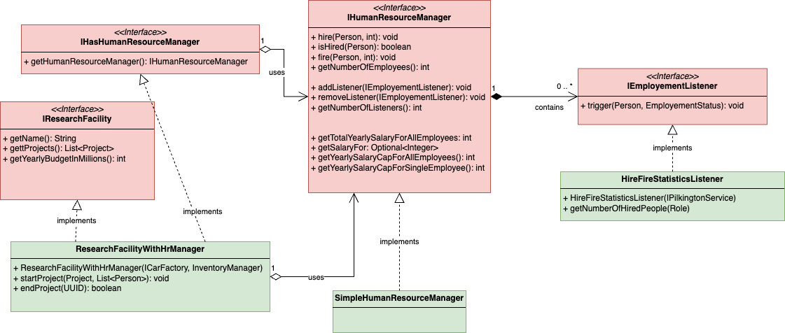

# Del 5 (20%)

Denne delen handlar om delegering, eigendefinerte unntak og teknikken observatør-observert.

Du vil implementera følgjande klassar:

* [HireFireStatisticsListener.java](HireFireStatisticsListener.java)
* [SimpleHumanResourceManager.java](SimpleHumanResourceManager.java)
* [ResearchFacilityWithHrManager.java](ResearchFacilityWithHrManager.java)

## Kontekst
Hver forskingsfasilitet treng ein god måte å handtera sine tilsette på.

For å sikra at Mercedes har fleksibiliteten til å handtera denne kompleksiteten, må du implementera 
noka åtferd i ulike klassar.

Nedanfor er UML-klassediagrammet for denne delen. Klassane i RAUDT er gitt.
Klassane i GRØNT er dei du må implementera.

## Oppgåver

1. Implementer klassen [SimpleHumanResourceManager](SimpleHumanResourceManager.java).
1. Implementer klassen [HireFireStatisticsListener](HireFireStatisticsListener.java).
1. Implementer klassen [ResearchFacilityWithHrManager](ResearchFacilityWithHrManager.java).

# Enhetstester

Eit komplett sett med einingstestar er levert for å støtta deg for denne delen.
* [Testar for SimpleHumanResourceManager](../../../../../test/java/com/mercedesbenz/part5/SimpleHumanResourceManagerTests.java)
* [Testar for HireFireStatisticsListener](../../../../../test/java/com/mercedesbenz/part5/HireFireStatisticsListenerTests.java)
* [Testar for ResearchFacilityWithHrManager](../../../../../test/java/com/mercedesbenz/part5/ResearchFacilityWithHrManagerTests.java)